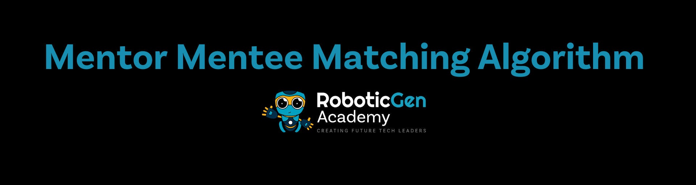

# Mentor Mentee Matching Algorithm

The mentor-mentee matching algorithm is a solution for automating the process of pairing mentors with mentees at [Roboticgen Academy](https://roboticgenacademy.com/). Currently, this task is performed manually by the HR team, which is manageable for a small number of students. However, as the academy scales and incorporates a larger student base, manual pairing becomes inefficient and error-prone. Automating this process ensures fairness, consistency, and optimal matching based on predefined criteria.

# Why We Need This
- Manual matching is time-consuming and lacks scalability.
- Larger student groups require an algorithmic approach for efficiency.
- Ensures fairness in mentor allocation and optimal use of available resources.

> [!TIP]
> Need More Information? Check out the [Wiki](https://github.com/RoboticGen/Mentor-Mentee-Matching-Algorithm/wiki)

